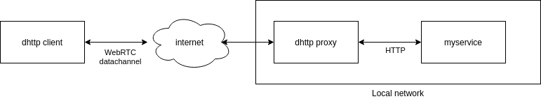

# dhttp 

HTTP over WebRTC proxy.

    

## Rationale

This project is exploring and expanding the capabilities of the [PeerJS pyhthon](https://github.com/ambianic/peerjs-python) HTTP over WebRTC proxy module. 

The objective is to provide a standalone service to interact with local devices over webRTC, bypassing limitation from firewalls and network operators constraints.

## Status

The service is a work in progress, altought the basic communication  is implemented. See tests for details. Feel free to open an issue and provide a PR if you see room for improvement.

## License 

Apache 2